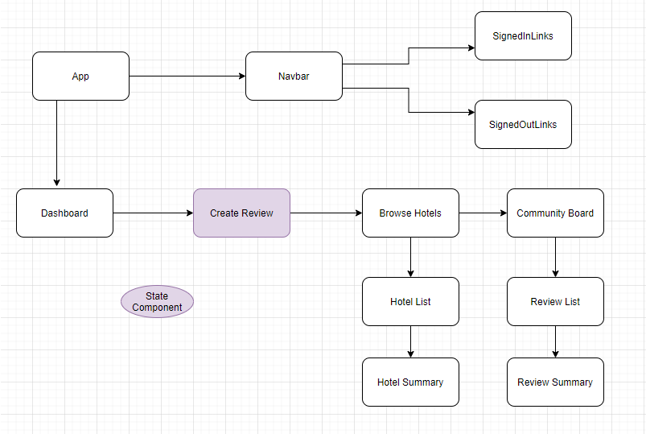

<center>

# **ScreamBnB**
Project Initiated: 26-02-2021
<br>
Updated: 10-03-2021

## **Project Description**

ScreamBnB is a hotel, motel, and BnB booking sight for those who want to spice up their trip! Are you a fan of history, horror, and true crime? Then you have found your accommodation booking sight, as we only deal with haunted places! This application will give users access to accommodations all throughout the USA and will include the history of the haunt, a photos and links to book a room at your favorite spooky place! There will also be a community board, for lovers of everything spooky to leave reviews and recommendations on things to do/see in different locations across the US. Users will create an account upon entering and then have the option to look through our built in database or leave us information on their own spooky stays for other users to check out!


| ID | User Story | Accepted |
|---------|-----------|--------|
| US01 | "As a user, I want to be able to make an account with ScreamBnB."| True |
| US02 | "As the user, I want to be able to access ScreamBnb's list of hotels."| True |
| US03 | "As the user, I want to be able to click on a hotel to see it's detail page and access a booking link." | True |
| US04 | "As the user, I want to access the community board of ScreamBnB." | True |
| US05 | "As the user, I want to be able to leave my own reviews/recommendations and view them in the community board." | True |

## Component Tree Diagram



</center>

### **Install/Setup Project** ###

**Option 1** (download zip file)
1) Copy and paste the following GitHub project link into your web browser's url bar and hit enter/return. https://github.com/Sarahgilbert064/ScreamBnB.git
2) Download a .zip copy the repository by clicking on the large green "Code" button near the upper right corner of the screen.
3) Right click the .zip file and extract(unzip) it's contents.
4) Open your computer's terminal/console, and navigate to folder called "__screambnb__". 


**Option 2** (via git console/terminal)
1) Open your Git enabled terminal/console and navigate to a directory that you wish to download this project to.
2) Type the following line of code into your terminal/console to automatically download the project to your current direcory and hit return/enter

    <code>git clone https://github.com/SarahGilbert064/ScreamBnB.git</code>

3) Once the project has finished downloading, use the terminal/console to navigate to the "__screambnb__" folder of the project.


## Available Scripts

In the project directory, you can run:

### `npm install`

This will install all dependencies needed for this application.

### `npm run build`

Builds the app for production to the `build` folder.\
It correctly bundles React in production mode and optimizes the build for the best performance.

The build is minified and the filenames include the hashes.\
Your app is ready to be deployed!

See the section about [deployment](https://facebook.github.io/create-react-app/docs/deployment) for more information.


### `npm test`

Run this command in the project directory to test all reducers using Jest.

### `npm start`

Runs the app in the development mode.\
Open [http://localhost:3000](http://localhost:3000) to view it in the browser.

## **Known Bugs**
There are no known bugs

## **Technology Used**
* ReactJS
* Redux
* Firebase
* Firestore
* JavaScript
* Material-UI Framework
* Visual Studio Code
* CSS
* HMTL

  
------------------------------
## 👥 Contributors

| Author | Email |
|--------|:-----:|
| [Sarah Gilbert](https://www.linkedin.com/in/sarahgilbertpdx/) | [sarahgilbert064@gmail.com](mailto:sarahgilbert064@gmail.com) |
------------------------------

## 📝 Legal
```
MIT License

Copyright (c) 2021 Sarah Gilbert

Permission is hereby granted, free of charge, to any person obtaining a copy of this software and associated documentation files (the "Software"), to deal in the Software without restriction, including without limitation the rights to use, copy, modify, merge, publish, distribute, sublicense, and/or sell copies of the Software, and to permit persons to whom the Software is furnished to do so, subject to the following conditions:

The above copyright notice and this permission notice shall be included in all copies or substantial portions of the Software.

THE SOFTWARE IS PROVIDED "AS IS", WITHOUT WARRANTY OF ANY KIND, EXPRESS OR IMPLIED, INCLUDING BUT NOT LIMITED TO THE WARRANTIES OF MERCHANTABILITY, FITNESS FOR A PARTICULAR PURPOSE AND NONINFRINGEMENT. IN NO EVENT SHALL THE AUTHORS OR COPYRIGHT HOLDERS BE LIABLE FOR ANY CLAIM, DAMAGES OR OTHER LIABILITY, WHETHER IN AN ACTION OF CONTRACT, TORT OR OTHERWISE, ARISING FROM, OUT OF OR IN CONNECTION WITH THE SOFTWARE OR THE USE OR OTHER DEALINGS IN THE SOFTWARE.
```
<center><a href="#">Return to Top</a></center>
